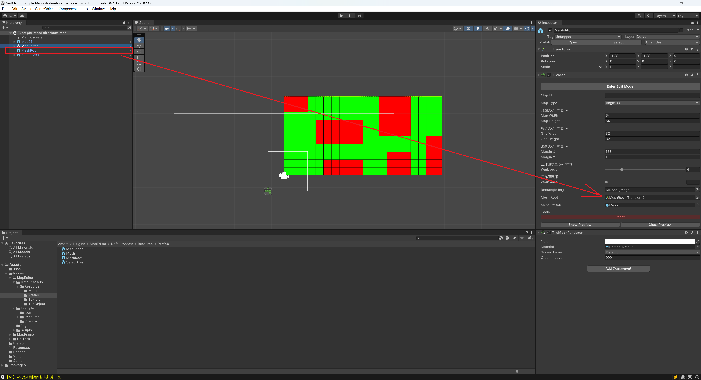
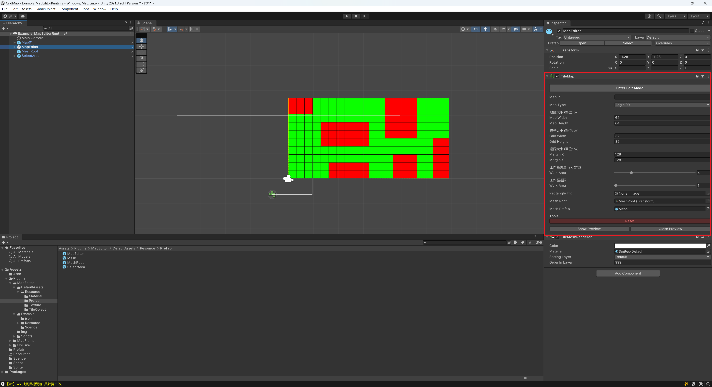

# unity_map_editor_dev(In Editor)
A unity map editor allow you to set grid node status.

## Quick Installation:
- Unity **2021LTS**.
- TextMeshPro **v3.0.6** or higher, you can install it via Package Manager.
- Ookii.Dialogs, view [Ookii.Dialogs releases](https://github.com/ookii-dialogs/ookii-dialogs-wpf/releases) here.
- Json.Net you can install it via AssetStore.
- MapFrame **v1.0.0** or higher, view [mapFrame releases](https://github.com/jasonben677/MapFrame/releases) here.
- Unity.Mathematics, you can import it via packeage manager.

## How to Use

### Step1.Drag MapEditor, SelectArea and MeshRoot prefab into hirearchy.

### Step2.After you Drag MapEditor prefab into a scene, Don't forget right click it to choose Prefab -> Unpack Completely.

### Step3.Check inspector of MapEditor has "Rectangle image" field, And drag or select SelectArea -> image to "Rectangle image" field of MapEditor. (which is a image help to draw a select area for rectangle)

### Step4.Check inspector of MapEditor has "MeshRoot" field, And drag or select MeshRoot -> "MeshRoot" field of MapEditor. (draw grid on workarea)

### Step5.Not in edit mode, there are two buttons

- Show all : show all grid.
- Close all : close all grid.
- When you have been click show all, remember click close all before enter edit mode.
### Step6.In MapEditor mode there are A, B, C will show in scene as follows.

- A : Select a tile by you to create before.
- B : Tools can choose a tool to draw.
- C : Map work area.
### Extra
- My device need slice map to 64*64 
	- CPU : i5-4590 3.3GHZ
	- GPU : AMD R7 200
	- RAM : 16GB
## Reference
- https://github.com/paullj/unity-tilemap

## License
- This library is under the MIT License.