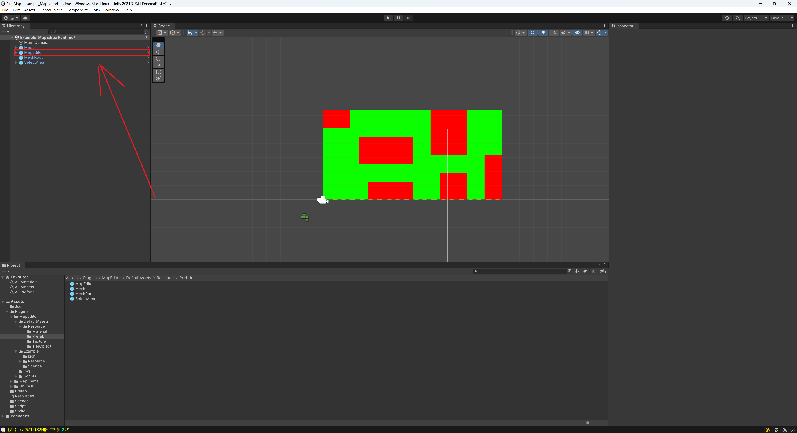
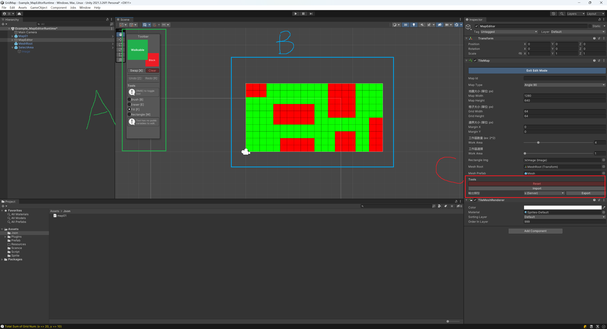

# MapEditor
A unity map editor allow you to set grid node status.

## 額外安裝
- Unity **2021LTS**.
- TextMeshPro **v3.0.6** or higher, you can install it via Package Manager.
- Ookii.Dialogs, view [Ookii.Dialogs releases](https://github.com/ookii-dialogs/ookii-dialogs-wpf/releases) here.
- Json.Net you can install it via AssetStore.
- MapFrame **v1.0.0** or higher, view [mapFrame releases](https://github.com/jasonben677/MapFrame/releases) here.
- Unity.Mathematics, you can import it via packeage manager.

## 使用教學

### Step1.將MapEditor, SelectArea and MeshRoot 的 prefab 放到 場景視窗中.

### Step2.將場景中MapEditor的prefab取消鏈結 : Prefab -> Unpack Completely.

### Step3.將場景中SelectArea的子物件"image"放到場景中MapEditor/TileMap程式的"Rectangle img"欄位中

### Step4.將場景中的MeshRoot放到場景中MapEditor/TileMap程式的"Mesh Root"欄位中

### Step5.當沒有點擊MapEditor/TileMap的Enter Edit Mode時，這裡會有兩個按鈕

- Show Preview : 顯示所有可繪製的網格節點
- Close Preview : 關閉所有可繪製的網格節點
### Step6.當點擊MapEditor/TileMap的Enter Edit Mode後，會有3個主要區塊，以下用 A, B, C 表示

- A : 選擇要畫在網格上的TileAsset跟繪製的方式.
- B : 進行繪製的區域，直接在上面點擊滑鼠左鍵
- C : 進行地圖輸出或是要重置整張地圖資料
### Extra
- My device need slice map to 64*64 
	- CPU : i5-4590 3.3GHZ
	- GPU : AMD R7 200
	- RAM : 16GB
## Reference
- https://github.com/paullj/unity-tilemap

## License
- This library is under the MIT License.